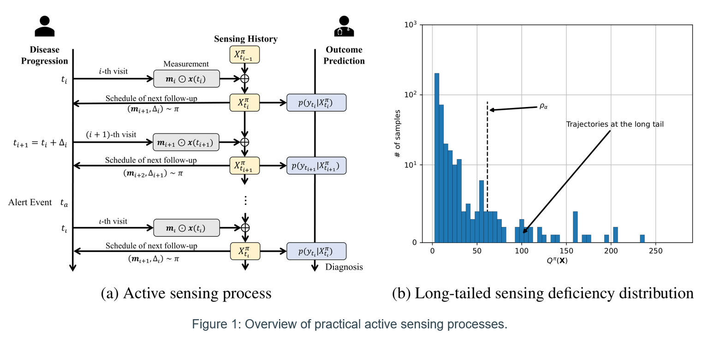
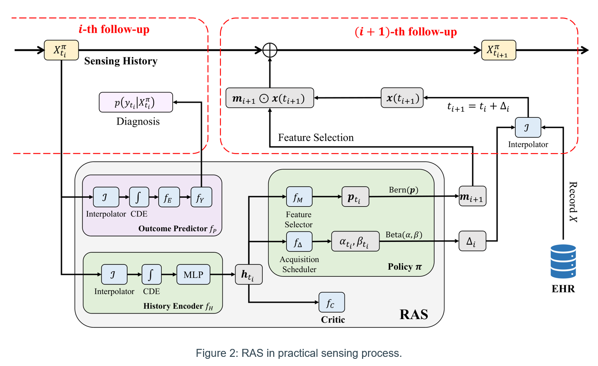
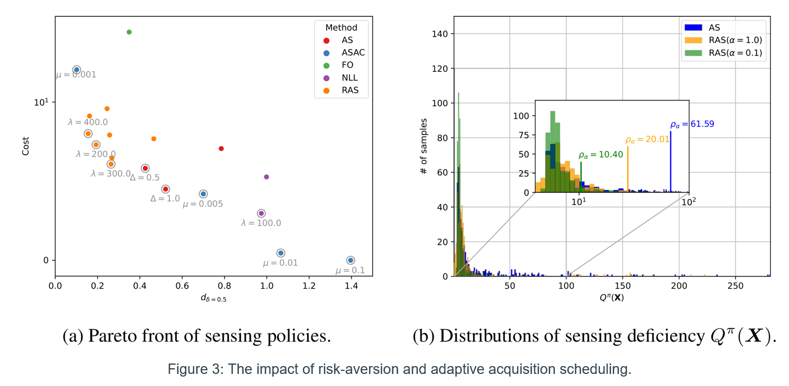

# Risk-Averse Active Sensing for Timely Outcome Prediction under Cost Pressure (NeurIPS 2023)
Source code of the continuous-time active sensing approach proposed in "Risk-Averse Active Sensing for Timely Outcome Prediction under Cost Pressure".


## Risk-averse active sensing
Timely diagnosis of disease progression is crucial for early interventions of adverse events. Frequent measurements of key risk factors could be notably expensive while being essential for accurate predictions. Active sensing problem is thus introduced to achieve the appropriate trade-off between the diagnosis accuracy (timeliness) and the acquisition cost involved in the sensing process.
A desirable sensing strategy shall actively collect diagnosis-related information during longitudinal follow-ups to a patient’s health status while maintaining a reasonable expense of feature acquisition.

<p align="center">

</p>

However, there are two practical challenges that confound existing active sensing approaches.

### Adaptive follow-up intervals
Measurements of patient covariates only happen at discrete follow-ups. The active sensing policy needs to adaptively adjust the follow-up intervals for patients at different disease stages.

### Failures at the long tail
In many scenarios (e.g., the Alzheimer's disease), high-risk patients are less frequently observed in the population. The imbalanced health status distribution yields poor diagnosis accuracy (and biased trade-off with acquisition cost) for high-risk patients. Such type of failures are closely related to the long tail shown in Figure 1(b).

<p align="center">

</p>


### Towards risk-averse sensing strategies
In this work, we propose a novel continuous-time active sensing approach RAS to address the aforementioned challenges.
RAS factorizes the sensing policy into two orthogonal policies $\pi=(\pi_m,\pi_\Delta)$.
- $\pi_\Delta$ schedules the interval $\Delta$ to the next follow-up of a patient.
- $\pi_𝑚$ selects which observations $\mathbf{m}$ of patient covariates to make.

<p align="center">

</p>


We formulate the considered active sensing task into a risk-averse optimization problem based on the notion of conditional value-at-risk (CVaR) and search for optimal sensing strategies that reduce sensing failures at the long tail illustrated in Figure 1.

Specifically, RAS seeks to solve the problem of
$`\min_{\pi} \mathrm{CVaR}_\alpha \triangleq \mathbb{E}_{\mathbf{X}\in S^\pi_\alpha} [Q^\pi(\mathbf{X})]`$.

- Factor $\alpha$ is used to identify patients with sensing deficiency scores $Q^\pi(\mathbf{X})$ above the upper $\alpha$-quantile $\rho_\alpha$ of the population.
- Sensing deficiency $Q^\pi(\mathbf{X})$ is the weighted sum of diagnosis error and acquisition cost in the sensing process for patient $\mathbf{X}$.
- Subset $`S^\pi_\alpha = \{\mathbf{X}| Q^\pi(\mathbf{X}) \geq \rho_\alpha\}`$ collects patients that suffer from the sensing failures at the long tail.

### The effectiveness of risk-aversion
We demonstrate with experiments that the risk-averse policy learned by RAS can find appropriate trade-offs (knee points of the Pareto front) between diagnosis accuracy and acquisition cost by effectively reducing the tail size (as reflected in $\rho_\alpha$) of sensing deficiency $Q^\pi(\mathbf{X})$ distribution.

<p align="center">

</p>


## Installation
This package can be installed by running the following command.
```bash
pip install "cvar_sensing @ git+https://github.com/yvchao/cvar_sensing.git"
```

## Experiments
The experiments related code can be found in folder [experiments](./experiments).
A summary of the experimental results can be found in [reports/analysis.md](./reports/analysis.md)

## Citation
If you find this work useful for your research, please kindly consider citing our paper.
```bibtex
@inproceedings{qin2023riskaverse,
  title={Risk-Averse Active Sensing for Timely Outcome Prediction under Cost Pressure},
  author={Qin, Yuchao and van der Schaar, Mihaela and Lee, Changhee},
  booktitle={Thirty-seventh Conference on Neural Information Processing Systems},
  year={2023},
  url={https://openreview.net/forum?id=aw1vLo7TE7}
}
```
