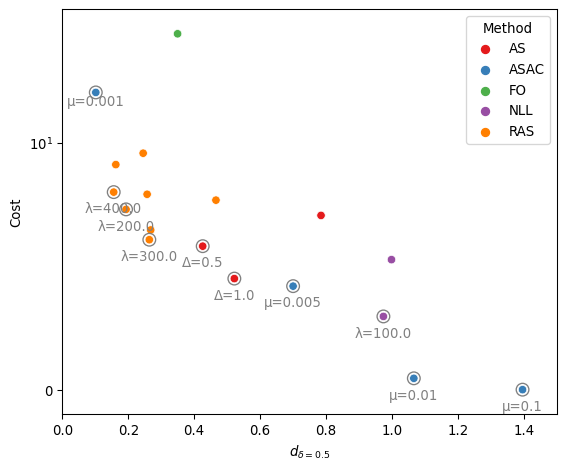
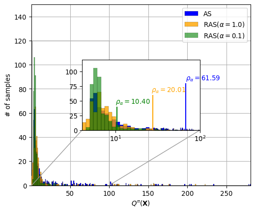

# Analyses of the experimental results

## Benchmark results

### Synthetic dataset

For each method, we select the hyperparameter based on their *cost
efficiency*, i.e., the achieved accuracy (PRC) per unit acquisition
cost. We ignore the sensing policies that made no observation (cost =
0). The benchmark result of RAS agains baselines are shown as follows.

<details>
<summary>Benchmark evaluation on the synthetic dataset.</summary>

```` markdown
```{python}
# | code-fold: true
# | code-summary: Benchmark evaluation on the synthetic dataset.
# | code-overflow: wrap
# | warning: false
# | output: asis
grouped = metrics.groupby(["method", "params"])
df = pd.DataFrame(columns=metrics.columns)
for i, (m, g) in enumerate(grouped):
    stats = g[scores].apply(mean_confidence_interval)
    stats = stats.iloc[:2].apply(lambda x: f"{x.iloc[0]:.3f}±{x.iloc[1]:.3f}", axis=0)
    df.loc[i] = stats
    df.loc[i, ["method", "params"]] = m

report = []
report.append(df[df["method"] == "FO"])
for m, g in df.groupby("method"):
    if m == "FO":
        continue

    # For each method, we select the most "cost-efficient" model for the benchmark.
    # Thus, we consider the accuracy (PRC) per unit acquisition cost.
    prc = g["prc"].apply(lambda s: float(s.split("±")[0]))
    cost = g["cost"].apply(lambda s: float(s.split("±")[0]))
    w = prc / (cost * (cost > 0) + 1e10 * (cost == 0))
    idx = w.argmax()
    report.append(g.iloc[[idx]])
report = pd.concat(report)

result = report[["method", "params"] + scores].rename(
    columns={
        "method": "Method",
        "params": "Params",
        "roc": "ROC",
        "prc": "PRC",
        "cost": "Cost",
        "delay(p>=0.3)": "d_{δ=0.3}",
        "delay(p>=0.5)": "d_{δ=0.5}",
        "delay(p>=0.7)": "d_{δ=0.7}",
    }
)
print(result.to_markdown()) # noqa
```
````

</details>

|     | Method | Params  | ROC         | PRC         | Cost         | d\_{δ=0.3}  | d\_{δ=0.5}  | d\_{δ=0.7}  |
|----:|:-------|:--------|:------------|:------------|:-------------|:------------|:------------|:------------|
|   7 | FO     |         | 0.680±0.000 | 0.655±0.000 | 31.000±0.000 | 0.502±0.000 | 0.349±0.000 | 0.285±0.000 |
|   2 | AS     | Δ=1.0   | 0.671±0.001 | 0.614±0.001 | 4.501±0.497  | 0.577±0.029 | 0.522±0.012 | 0.479±0.015 |
|   5 | ASAC   | μ=0.01  | 0.605±0.096 | 0.559±0.080 | 0.460±1.078  | 1.099±0.664 | 1.066±0.699 | 1.052±0.641 |
|   8 | NLL    | λ=100.0 | 0.636±0.023 | 0.588±0.016 | 2.968±0.774  | 0.993±0.131 | 0.974±0.141 | 0.975±0.147 |
|  13 | RAS    | λ=300.0 | 0.680±0.003 | 0.647±0.006 | 6.077±0.953  | 0.325±0.084 | 0.264±0.086 | 0.246±0.071 |

In the following table, we mark the location of the best performance in
each column and evalute the $p$-values by performance t-test against the
rest methods.

|     | Method | ROC   | PRC   | Cost  | d\_{δ=0.3} | d\_{δ=0.5} | d\_{δ=0.7} |
|----:|:-------|:------|:------|:------|:-----------|:-----------|:-----------|
|   7 | FO     | best  | best  | 0.000 | 0.000      | 0.003      | 0.043      |
|   2 | AS     | 0.000 | 0.000 | 0.000 | 0.000      | 0.000      | 0.000      |
|   5 | ASAC   | 0.009 | 0.001 | best  | 0.001      | 0.001      | 0.001      |
|   8 | NLL    | 0.000 | 0.000 | 0.000 | 0.000      | 0.000      | 0.000      |
|  13 | RAS    | 1.000 | 0.000 | 0.000 | best       | best       | best       |

Below, we propose one optional criterion to find the best method by
considering both acquisition cost and diagnositic accuracy. We consider
the FO baseline with dense sensing histories as a reference, and find
the optimal sensing history that achieves the largest acquisition cost
reduction while maintaining a reasonable accuracy. Our criterion is
defiend as follows for each method (except for the FO baseline).

$$
\frac{\max (0, \text{PRC}_{\text{FO}} - \text{PRC})}{\text{Cost}_{\text{FO}} - \text{Cost}},
$$

where a small value indicates more effective active sensing strategy
(small loss in accuracy but high reduction in acquisition cost).

<details>
<summary>Find the overally best method.</summary>

```` markdown
```{python}
# | code-fold: true
# | code-summary: Find the overally best method.
# | code-overflow: wrap
# | output: asis
perf_fo = report[report["method"]=="FO"]
rest = report[report["method"]!="FO"]
PRC_FO, COST_FO = perf_fo["prc"].item(), perf_fo["cost"].item()
PRC_FO = float(PRC_FO.split("±")[0])
COST_FO = float(COST_FO.split("±")[0])

prc = rest["prc"].apply(lambda s: float(s.split("±")[0]))
cost = rest["cost"].apply(lambda s: float(s.split("±")[0]))
w = (PRC_FO - prc).clip(0)/(COST_FO - cost)
idx = w.argmin()
best_method = rest.iloc[idx]["method"]
best_params = rest.iloc[idx]["params"]
print(f"Based on the above criterion, the best method is {best_method} ({best_params})") # noqa
```
````

</details>

Based on the above criterion, the best method is RAS (λ=300.0)

### ADNI dataset

We perform similar analysis on the ADNI dataset. The benchmark results
are given below.

|     | Method | Params  | ROC         | PRC         | Cost         | d\_{δ=0.1}  | d\_{δ=0.3}  | d\_{δ=0.5}  |
|----:|:-------|:--------|:------------|:------------|:-------------|:------------|:------------|:------------|
|   6 | FO     |         | 0.747±0.000 | 0.577±0.000 | 26.865±0.000 | 0.141±0.000 | 0.510±0.000 | 0.591±0.000 |
|   1 | AS     | Δ=1.5   | 0.704±0.023 | 0.519±0.034 | 3.566±0.854  | 1.326±0.096 | 2.314±0.348 | 2.357±0.375 |
|   5 | ASAC   | μ=0.1   | 0.521±0.160 | 0.352±0.103 | 0.043±0.186  | 0.527±0.000 | 3.008±3.610 | 3.581±0.000 |
|   8 | NLL    | λ=200.0 | 0.697±0.018 | 0.512±0.020 | 3.986±0.493  | 1.040±0.149 | 2.176±0.060 | 2.739±0.135 |
|  15 | RAS    | λ=400.0 | 0.730±0.007 | 0.560±0.012 | 8.614±1.157  | 0.820±0.096 | 1.370±0.227 | 1.192±0.176 |

The best performance in each column and the overall best method is
reported as follows.

|     | Method | ROC   | PRC   | Cost  | delay(p\>=0.1) | d\_{δ=0.3} | d\_{δ=0.5} |
|----:|:-------|:------|:------|:------|:---------------|:-----------|:-----------|
|   6 | FO     | best  | best  | 0.000 | best           | best       | best       |
|   1 | AS     | 0.003 | 0.004 | 0.000 | 0.000          | 0.000      | 0.000      |
|   5 | ASAC   | 0.009 | 0.002 | best  | 0.000          | 0.079      | 0.000      |
|   8 | NLL    | 0.001 | 0.000 | 0.000 | 0.000          | 0.000      | 0.000      |
|  15 | RAS    | 0.001 | 0.009 | 0.000 | 0.000          | 0.000      | 0.000      |

Based on our proposed criterion, the best method is RAS (λ=400.0)

Our method achieves a desirable balance between diagnosis accuracy and
acquisition cost and is evaluated to be the best sensing policy.

## Discussion

### Trade-off between timeliness and acquisition costs.

The selection of model parameters could be difficult when two or more
criteria are involved in the evaluation. Here, we illustrate the sensing
performance of different policies on the synthetic dataset and highlight
the ones in the Pareto front with gray circles in
[Figure 1](#fig-pareto-front).



These policies are considered Pareto optimal since their timeliness
($d_{δ=0.5}$) and average acquisition cost cannot be simultaneously
improved by swapping parameters with other policies. Benefitted from the
risk-averse training strategy, most sensing policies obtained via RAS
are centered around the knee point of the Pareto front, which helps to
explain the outstanding cost efficiency of RAS as reported above.

### Improvement of the sensing deficiency distribution

To illustrate the effectiveness of our risk-averse active sensing
approach, we compare the empirical distribution of sensing deficiency
$Q^π(X)$ of RAS with the ablations of risk-neutral sensing ($α = 1.0$)
and AS baseline ($α = 1.0$, constant acquisition interval $∆ = 1.0$) on
the synthetic dataset. All three models are trained with the same
trade-off coefficient $λ = 300$. As illustrated in
[Figure 2](#fig-sensing-deficiency), RAS is able to effectively optimize
the sensing performance for trajectories in the long tail of sensing
deficency distribution and reduces the upper $α$-quantile of $Q^π(X)$ to
$ρ_{α=0.1} = 10.40$. Factor α = 1.0 completely disables the
risk-aversion training strategy in RAS. Thereby, a clear increase of
sensing deficiency (quantile $ρ_{α=0.1}$ grows from 10.40 to 20.01) is
observed with the risk-neutral ablation of RAS. Similarly, without
adaptive scheduling of acquisition intervals and risk-averse
optimization strategies, the AS baseline illustrates the failure of
conventional active sensing paradigms at the long tail of $Q^π(X)$
distribution.


